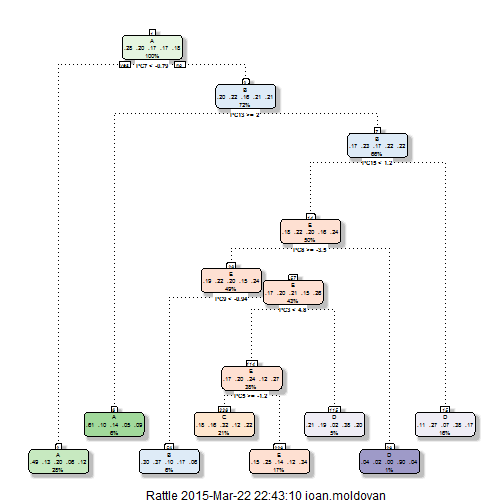

Predicting activity type from accelerometer data
========================================================

# Synopsis
Using devices such as Jawbone Up, Nike FuelBand, and Fitbit it is now possible to collect a large amount of data about personal activity relatively inexpensively. These type of devices are part of the quantified self movement - a group of enthusiasts who take measurements about themselves regularly to improve their health, to find patterns in their behavior, or because they are tech geeks. One thing that people regularly do is quantify how much of a particular activity they do, but they rarely quantify how well they do it. 

The purpose of this experiment is to use data from accelerometers on the belt, forearm, arm, and dumbell of 6 participants. They were asked to perform barbell lifts correctly and incorrectly in 5 different ways. 

We will try to build up a machine learning algorithm predicting the exercise type based on these measurements.

# Data Exploration

First we will load the training dataset, randomize it and split it in 2 parts, a train dataset (70% of the data), which we will split during learning into train and validation, and a test dataset (30% of the data).
We will train our algorithms on the train set with cross validation and use the test dataset only in the final step, to evaluate our out-of-sample error.
We will not use the actual pml-testing.csv dataset provided for anything else than submitting the prediction.


```r
library(dplyr)
set.seed(123)
dataset <- read.csv("pml-training.csv")
dataset <- cbind(dataset, sample(c(1,2), nrow(dataset), prob=c(0.7, 0.3), replace=T))
colnames(dataset)[161] <- "set_id"
train <- dataset %>% filter(set_id==1)
test <- dataset %>% filter(set_id==2)
test_final <- read.csv("pml-testing.csv")
```

We check that the distribution is correct

```r
nrow(train)
```

```
## [1] 13808
```

```r
unique(train[,160])
```

```
## [1] A B C D E
## Levels: A B C D E
```

```r
nrow(test)
```

```
## [1] 5814
```

```r
unique(test[,160])
```

```
## [1] A B C D E
## Levels: A B C D E
```

We check then the available factors which we can use for prediction

```r
str(train)
```

```
## 'data.frame':	13808 obs. of  161 variables:
##  $ X                       : int  1 3 6 7 9 10 12 13 14 15 ...
##  $ user_name               : Factor w/ 6 levels "adelmo","carlitos",..: 2 2 2 2 2 2 2 2 2 2 ...
##  $ raw_timestamp_part_1    : int  1323084231 1323084231 1323084232 1323084232 1323084232 1323084232 1323084232 1323084232 1323084232 1323084232 ...
##  $ raw_timestamp_part_2    : int  788290 820366 304277 368296 484323 484434 528316 560359 576390 604281 ...
##  $ cvtd_timestamp          : Factor w/ 20 levels "02/12/2011 13:32",..: 9 9 9 9 9 9 9 9 9 9 ...
##  $ new_window              : Factor w/ 2 levels "no","yes": 1 1 1 1 1 1 1 1 1 1 ...
##  $ num_window              : int  11 11 12 12 12 12 12 12 12 12 ...
##  $ roll_belt               : num  1.41 1.42 1.45 1.42 1.43 1.45 1.43 1.42 1.42 1.45 ...
##  $ pitch_belt              : num  8.07 8.07 8.06 8.09 8.16 8.17 8.18 8.2 8.21 8.2 ...
##  $ yaw_belt                : num  -94.4 -94.4 -94.4 -94.4 -94.4 -94.4 -94.4 -94.4 -94.4 -94.4 ...
##  $ total_accel_belt        : int  3 3 3 3 3 3 3 3 3 3 ...
##  $ kurtosis_roll_belt      : Factor w/ 397 levels "","-0.016850",..: 1 1 1 1 1 1 1 1 1 1 ...
##  $ kurtosis_picth_belt     : Factor w/ 317 levels "","-0.021887",..: 1 1 1 1 1 1 1 1 1 1 ...
##  $ kurtosis_yaw_belt       : Factor w/ 2 levels "","#DIV/0!": 1 1 1 1 1 1 1 1 1 1 ...
##  $ skewness_roll_belt      : Factor w/ 395 levels "","-0.003095",..: 1 1 1 1 1 1 1 1 1 1 ...
##  $ skewness_roll_belt.1    : Factor w/ 338 levels "","-0.005928",..: 1 1 1 1 1 1 1 1 1 1 ...
##  $ skewness_yaw_belt       : Factor w/ 2 levels "","#DIV/0!": 1 1 1 1 1 1 1 1 1 1 ...
##  $ max_roll_belt           : num  NA NA NA NA NA NA NA NA NA NA ...
##  $ max_picth_belt          : int  NA NA NA NA NA NA NA NA NA NA ...
##  $ max_yaw_belt            : Factor w/ 68 levels "","-0.1","-0.2",..: 1 1 1 1 1 1 1 1 1 1 ...
##  $ min_roll_belt           : num  NA NA NA NA NA NA NA NA NA NA ...
##  $ min_pitch_belt          : int  NA NA NA NA NA NA NA NA NA NA ...
##  $ min_yaw_belt            : Factor w/ 68 levels "","-0.1","-0.2",..: 1 1 1 1 1 1 1 1 1 1 ...
##  $ amplitude_roll_belt     : num  NA NA NA NA NA NA NA NA NA NA ...
##  $ amplitude_pitch_belt    : int  NA NA NA NA NA NA NA NA NA NA ...
##  $ amplitude_yaw_belt      : Factor w/ 4 levels "","#DIV/0!","0.00",..: 1 1 1 1 1 1 1 1 1 1 ...
##  $ var_total_accel_belt    : num  NA NA NA NA NA NA NA NA NA NA ...
##  $ avg_roll_belt           : num  NA NA NA NA NA NA NA NA NA NA ...
##  $ stddev_roll_belt        : num  NA NA NA NA NA NA NA NA NA NA ...
##  $ var_roll_belt           : num  NA NA NA NA NA NA NA NA NA NA ...
##  $ avg_pitch_belt          : num  NA NA NA NA NA NA NA NA NA NA ...
##  $ stddev_pitch_belt       : num  NA NA NA NA NA NA NA NA NA NA ...
##  $ var_pitch_belt          : num  NA NA NA NA NA NA NA NA NA NA ...
##  $ avg_yaw_belt            : num  NA NA NA NA NA NA NA NA NA NA ...
##  $ stddev_yaw_belt         : num  NA NA NA NA NA NA NA NA NA NA ...
##  $ var_yaw_belt            : num  NA NA NA NA NA NA NA NA NA NA ...
##  $ gyros_belt_x            : num  0 0 0.02 0.02 0.02 0.03 0.02 0.02 0.02 0 ...
##  $ gyros_belt_y            : num  0 0 0 0 0 0 0 0 0 0 ...
##  $ gyros_belt_z            : num  -0.02 -0.02 -0.02 -0.02 -0.02 0 -0.02 0 -0.02 0 ...
##  $ accel_belt_x            : int  -21 -20 -21 -22 -20 -21 -22 -22 -22 -21 ...
##  $ accel_belt_y            : int  4 5 4 3 2 4 2 4 4 2 ...
##  $ accel_belt_z            : int  22 23 21 21 24 22 23 21 21 22 ...
##  $ magnet_belt_x           : int  -3 -2 0 -4 1 -3 -2 -3 -8 -1 ...
##  $ magnet_belt_y           : int  599 600 603 599 602 609 602 606 598 597 ...
##  $ magnet_belt_z           : int  -313 -305 -312 -311 -312 -308 -319 -309 -310 -310 ...
##  $ roll_arm                : num  -128 -128 -128 -128 -128 -128 -128 -128 -128 -129 ...
##  $ pitch_arm               : num  22.5 22.5 22 21.9 21.7 21.6 21.5 21.4 21.4 21.4 ...
##  $ yaw_arm                 : num  -161 -161 -161 -161 -161 -161 -161 -161 -161 -161 ...
##  $ total_accel_arm         : int  34 34 34 34 34 34 34 34 34 34 ...
##  $ var_accel_arm           : num  NA NA NA NA NA NA NA NA NA NA ...
##  $ avg_roll_arm            : num  NA NA NA NA NA NA NA NA NA NA ...
##  $ stddev_roll_arm         : num  NA NA NA NA NA NA NA NA NA NA ...
##  $ var_roll_arm            : num  NA NA NA NA NA NA NA NA NA NA ...
##  $ avg_pitch_arm           : num  NA NA NA NA NA NA NA NA NA NA ...
##  $ stddev_pitch_arm        : num  NA NA NA NA NA NA NA NA NA NA ...
##  $ var_pitch_arm           : num  NA NA NA NA NA NA NA NA NA NA ...
##  $ avg_yaw_arm             : num  NA NA NA NA NA NA NA NA NA NA ...
##  $ stddev_yaw_arm          : num  NA NA NA NA NA NA NA NA NA NA ...
##  $ var_yaw_arm             : num  NA NA NA NA NA NA NA NA NA NA ...
##  $ gyros_arm_x             : num  0 0.02 0.02 0 0.02 0.02 0.02 0.02 0.02 0.02 ...
##  $ gyros_arm_y             : num  0 -0.02 -0.03 -0.03 -0.03 -0.03 -0.03 -0.02 0 0 ...
##  $ gyros_arm_z             : num  -0.02 -0.02 0 0 -0.02 -0.02 0 -0.02 -0.03 -0.03 ...
##  $ accel_arm_x             : int  -288 -289 -289 -289 -288 -288 -288 -287 -288 -289 ...
##  $ accel_arm_y             : int  109 110 111 111 109 110 111 111 111 111 ...
##  $ accel_arm_z             : int  -123 -126 -122 -125 -122 -124 -123 -124 -124 -124 ...
##  $ magnet_arm_x            : int  -368 -368 -369 -373 -369 -376 -363 -372 -371 -374 ...
##  $ magnet_arm_y            : int  337 344 342 336 341 334 343 338 331 342 ...
##  $ magnet_arm_z            : int  516 513 513 509 518 516 520 509 523 510 ...
##  $ kurtosis_roll_arm       : Factor w/ 330 levels "","-0.02438",..: 1 1 1 1 1 1 1 1 1 1 ...
##  $ kurtosis_picth_arm      : Factor w/ 328 levels "","-0.00484",..: 1 1 1 1 1 1 1 1 1 1 ...
##  $ kurtosis_yaw_arm        : Factor w/ 395 levels "","-0.01548",..: 1 1 1 1 1 1 1 1 1 1 ...
##  $ skewness_roll_arm       : Factor w/ 331 levels "","-0.00051",..: 1 1 1 1 1 1 1 1 1 1 ...
##  $ skewness_pitch_arm      : Factor w/ 328 levels "","-0.00184",..: 1 1 1 1 1 1 1 1 1 1 ...
##  $ skewness_yaw_arm        : Factor w/ 395 levels "","-0.00311",..: 1 1 1 1 1 1 1 1 1 1 ...
##  $ max_roll_arm            : num  NA NA NA NA NA NA NA NA NA NA ...
##  $ max_picth_arm           : num  NA NA NA NA NA NA NA NA NA NA ...
##  $ max_yaw_arm             : int  NA NA NA NA NA NA NA NA NA NA ...
##  $ min_roll_arm            : num  NA NA NA NA NA NA NA NA NA NA ...
##  $ min_pitch_arm           : num  NA NA NA NA NA NA NA NA NA NA ...
##  $ min_yaw_arm             : int  NA NA NA NA NA NA NA NA NA NA ...
##  $ amplitude_roll_arm      : num  NA NA NA NA NA NA NA NA NA NA ...
##  $ amplitude_pitch_arm     : num  NA NA NA NA NA NA NA NA NA NA ...
##  $ amplitude_yaw_arm       : int  NA NA NA NA NA NA NA NA NA NA ...
##  $ roll_dumbbell           : num  13.1 12.9 13.4 13.1 13.2 ...
##  $ pitch_dumbbell          : num  -70.5 -70.3 -70.8 -70.2 -70.4 ...
##  $ yaw_dumbbell            : num  -84.9 -85.1 -84.5 -85.1 -84.9 ...
##  $ kurtosis_roll_dumbbell  : Factor w/ 398 levels "","-0.0035","-0.0073",..: 1 1 1 1 1 1 1 1 1 1 ...
##  $ kurtosis_picth_dumbbell : Factor w/ 401 levels "","-0.0163","-0.0233",..: 1 1 1 1 1 1 1 1 1 1 ...
##  $ kurtosis_yaw_dumbbell   : Factor w/ 2 levels "","#DIV/0!": 1 1 1 1 1 1 1 1 1 1 ...
##  $ skewness_roll_dumbbell  : Factor w/ 401 levels "","-0.0082","-0.0096",..: 1 1 1 1 1 1 1 1 1 1 ...
##  $ skewness_pitch_dumbbell : Factor w/ 402 levels "","-0.0053","-0.0084",..: 1 1 1 1 1 1 1 1 1 1 ...
##  $ skewness_yaw_dumbbell   : Factor w/ 2 levels "","#DIV/0!": 1 1 1 1 1 1 1 1 1 1 ...
##  $ max_roll_dumbbell       : num  NA NA NA NA NA NA NA NA NA NA ...
##  $ max_picth_dumbbell      : num  NA NA NA NA NA NA NA NA NA NA ...
##  $ max_yaw_dumbbell        : Factor w/ 73 levels "","-0.1","-0.2",..: 1 1 1 1 1 1 1 1 1 1 ...
##  $ min_roll_dumbbell       : num  NA NA NA NA NA NA NA NA NA NA ...
##  $ min_pitch_dumbbell      : num  NA NA NA NA NA NA NA NA NA NA ...
##  $ min_yaw_dumbbell        : Factor w/ 73 levels "","-0.1","-0.2",..: 1 1 1 1 1 1 1 1 1 1 ...
##  $ amplitude_roll_dumbbell : num  NA NA NA NA NA NA NA NA NA NA ...
##   [list output truncated]
```

We observe that from the variables available we have some describing the distribution of measurements during the activity (min, max, avg, stdev, kurtosis, skewness, variance) and other indicators, like the amplitude, gyroscopic measurements, acceleration.
We will include all these factors 

We see that we have timestamps which we can exclude from the prediciton algos and also a user label attached to the data. We can assume that each person has a "style" when performing the exercises, and although it is tempting to include the user as a factor, we are interesting in detecting the activity quality, and including the user could only lead us to bias. So it is reasonable to assume that when classifying an activity we will make it based on the measurements only, discrading the timestamps and the user information.

Thus, we build a dataset containing only measurements information


```r
removedCol <- c("X", "user_name", "raw_timestamp_part_1", "raw_timestamp_part_2", "cvtd_timestamp", "new_window", "num_window", "set_id")
train <- train[,!(names(train) %in% removedCol)]
test <- test[,!(names(test) %in% removedCol)]
test_final <- test_final[,!(names(test_final) %in% removedCol)]
```

# Building a learning algorithm

In order to prepare applying a machine learning algorithm on the data, we will normalize the datasets (by centering to the mean and scaling with the standard deviation).
We specify training params so that we perform the learning using 10-fold resampling and repeat the cross validation 5 times.

Since, after trying a first fit of the model, we find that the processing time needed is huge, we will first preprocess the data with PCA, in order to reduce the dimensionality.
The number of components should be chosen such that the variance captured is significant (>95%)


```r
library(caret)

#we have few columns with NAs, we could simply remove them, or replace their values with zeros
oldCols <- colnames(train)
pred <- train[,ncol(train)]
train = cbind(train[,sapply(train, is.numeric)], pred)
newCols <- colnames(train)
removedCols <- setdiff(oldCols, newCols)
removedCols <- removedCols[removedCols != "classe"]

test <- test[,!(names(test) %in% removedCols)]
test_final <- test_final[,!(names(test_final) %in% removedCols)]

train[is.na(train)] <- 0
test[is.na(test)] <- 0
test_final[is.na(test_final)] <- 0

pca = preProcess(train[,1:(ncol(train)-1)], method='pca', pcaComp=7)
```

We build new datasets with reduced dimensionality


```r
train2 = cbind(predict(pca, train[,1:(ncol(train)-1)]), train[,ncol(train)])
colnames(train2)[ncol(train2)] <- "classe"

test2 = cbind(predict(pca, test[,1:(ncol(test)-1)]), test[,ncol(test)])
colnames(test2)[ncol(test2)] <- "classe"

test_final2 = cbind(predict(pca, test_final[,1:(ncol(test_final)-1)]), test_final[,ncol(test_final)])
colnames(test_final2)[ncol(test_final2)] <- "classe"
```


```r
library(caret)

mod <- train(classe ~ ., data=train2, method="rpart", trControl=trainControl(method="repeatedcv", number=10, repeats=5));
```

We plot the resulted prediction tree


```r
library(rattle)
fancyRpartPlot(mod$finalModel)
```

 


## Cross-validation

We build the predicted values from the test data set, using the same features, extracted with the PCA tuned for the training set.
This gives us an estimate of the out of sampel error


```r
pred = predict(mod$finalModel, newdata=test2, type="class")
```

We check the cross-validation error:


```r
confusionMatrix(test2$classe, pred)
```

```
## Confusion Matrix and Statistics
## 
##           Reference
## Prediction    A    B    C    D    E
##          A 1059  111  199  154  141
##          B  256  131  211  292  210
##          C  415   28  375   73  152
##          D  124   56  135  493  129
##          E  216   29  243  232  350
## 
## Overall Statistics
##                                          
##                Accuracy : 0.4142         
##                  95% CI : (0.4015, 0.427)
##     No Information Rate : 0.356          
##     P-Value [Acc > NIR] : < 2.2e-16      
##                                          
##                   Kappa : 0.2538         
##  Mcnemar's Test P-Value : < 2.2e-16      
## 
## Statistics by Class:
## 
##                      Class: A Class: B Class: C Class: D Class: E
## Sensitivity            0.5116  0.36901   0.3224   0.3963   0.3564
## Specificity            0.8384  0.82249   0.8564   0.9028   0.8510
## Pos Pred Value         0.6364  0.11909   0.3595   0.5261   0.3271
## Neg Pred Value         0.7564  0.95248   0.8348   0.8460   0.8668
## Prevalence             0.3560  0.06106   0.2000   0.2140   0.1689
## Detection Rate         0.1821  0.02253   0.0645   0.0848   0.0602
## Detection Prevalence   0.2862  0.18920   0.1794   0.1612   0.1840
## Balanced Accuracy      0.6750  0.59575   0.5894   0.6496   0.6037
```


We find that we have quite a low accuracy, of only ~40%.
A more advanced prediction algo could be a SVM classifier using RBF kernels.


```r
library(caret)
library(kernlab)

d <- sigest(classe ~ ., data=train2, frac=1)
tuneGrid <- data.frame(.sigma = d[1], .C = 2^(-2:5))
mod2 <- train(classe ~ ., data=train2, method="svmRadial", preProc=c("center", "scale"), tuneGrid=tuneGrid, trControl=trainControl(method="repeatedcv", number=10, repeats=5))
```

Checking the results of this model, we have:


```r
predsvm = predict(mod2$finalModel, newdata=test2[-ncol(test2)], type="response")
confusionMatrix(test2$classe, predsvm)
```

```
## Confusion Matrix and Statistics
## 
##           Reference
## Prediction    A    B    C    D    E
##          A 1077  134    3   14  436
##          B   72  688    0   12  328
##          C  319  285  115   19  305
##          D  287   76    8  364  202
##          E  105  180   13   28  744
## 
## Overall Statistics
##                                          
##                Accuracy : 0.5139         
##                  95% CI : (0.501, 0.5269)
##     No Information Rate : 0.3466         
##     P-Value [Acc > NIR] : < 2.2e-16      
##                                          
##                   Kappa : 0.3799         
##  Mcnemar's Test P-Value : < 2.2e-16      
## 
## Statistics by Class:
## 
##                      Class: A Class: B Class: C Class: D Class: E
## Sensitivity            0.5790   0.5048  0.82734  0.83295   0.3692
## Specificity            0.8515   0.9074  0.83648  0.89344   0.9142
## Pos Pred Value         0.6472   0.6255  0.11026  0.38847   0.6953
## Neg Pred Value         0.8113   0.8568  0.99497  0.98503   0.7321
## Prevalence             0.3199   0.2344  0.02391  0.07516   0.3466
## Detection Rate         0.1852   0.1183  0.01978  0.06261   0.1280
## Detection Prevalence   0.2862   0.1892  0.17939  0.16116   0.1840
## Balanced Accuracy      0.7153   0.7061  0.83191  0.86319   0.6417
```

Performance is still not too good, so we try also a naive bayes classifier


```r
library(caret)
library(klaR)
mod3 <- train(classe ~ ., data=train2, method="nb", preProc=c("center", "scale"), trControl=trainControl(method="repeatedcv", number=10, repeats=5))
```


```r
prednb = predict(mod3$finalModel, newdata=test2[-ncol(test2)], type="class")
confusionMatrix(test2$classe, prednb$class)
```

```
## Confusion Matrix and Statistics
## 
##           Reference
## Prediction   A   B   C   D   E
##          A  24 863 110 227 440
##          B  18 606  87 102 287
##          C  18 446  93 151 335
##          D   9 426  53 217 232
##          E  21 392  83 116 458
## 
## Overall Statistics
##                                           
##                Accuracy : 0.2405          
##                  95% CI : (0.2295, 0.2517)
##     No Information Rate : 0.4701          
##     P-Value [Acc > NIR] : 1               
##                                           
##                   Kappa : 0.0686          
##  Mcnemar's Test P-Value : <2e-16          
## 
## Statistics by Class:
## 
##                      Class: A Class: B Class: C Class: D Class: E
## Sensitivity          0.266667   0.2217  0.21831  0.26691  0.26142
## Specificity          0.713487   0.8397  0.82368  0.85603  0.84934
## Pos Pred Value       0.014423   0.5509  0.08917  0.23159  0.42804
## Neg Pred Value       0.984096   0.5488  0.93020  0.87779  0.72723
## Prevalence           0.015480   0.4701  0.07327  0.13983  0.30134
## Detection Rate       0.004128   0.1042  0.01600  0.03732  0.07878
## Detection Prevalence 0.286206   0.1892  0.17939  0.16116  0.18404
## Balanced Accuracy    0.490077   0.5307  0.52100  0.56147  0.55538
```

This performs even worse, an option would be to combine the classifiers, but work still needs to be done to clean up variables, so that the prediction rates can be brought >80% before doing it.

Finally, we produce the results for the test sample


```r
pred1 = predict(mod$finalModel, newdata=test_final2, type="class")
pred2 = predict(mod2$finalModel, newdata=test_final2[-ncol(test_final2)], type="response")
pred3 = predict(mod3$finalModel, newdata=test_final2[-ncol(test_final2)], type="class")
pred1
```

```
##  1  2  3  4  5  6  7  8  9 10 11 12 13 14 15 16 17 18 19 20 
##  D  A  A  A  E  A  D  B  A  A  A  A  E  A  C  E  A  B  D  E 
## Levels: A B C D E
```

```r
pred2
```

```
##  [1] A E E A A E D B A A E E B E E A A E A B
## Levels: A B C D E
```

```r
pred3$class
```

```
##  [1] C E B E C D B B B B B E B B E E B E B D
## Levels: A B C D E
```

# Results

We built a machine learning algorithm to predict the activity type based on accelerometer data. Due to computational demands, we performed a dimensionality reduction and applied a prediction tree algorithm and a support vector machines algorithm. We were able to successfuly build multiple algos for predicting the class, with different accuracy levels, however the results are still unsatisfactory and more research is needed to build the proper classification algorithm.

